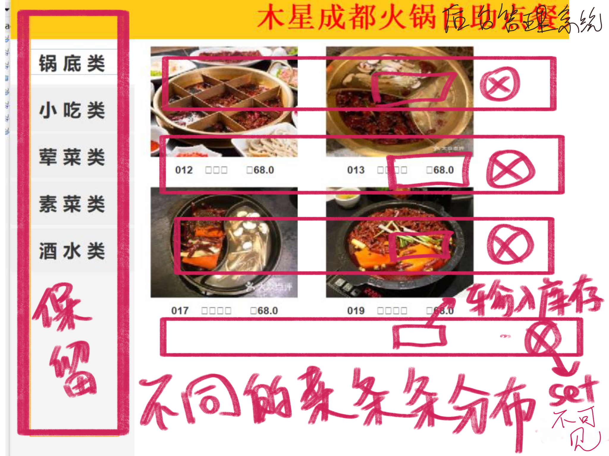

## 1. 整个项目

1. 我们或许可以通过git来协同合作，建立一个仓库，也当熟悉一下git！
2. 【GUI部分】整个程序的主题还是火锅店吗，我们需要整理菜单和图片等“信息”，尽量数据真实，图片统一。
3. 我们可以把源码重写，然后修BUG，先把原本的程序“复刻”出来后在做扩展
4. 最后考虑实验报告和Pre
    
我想的框架是这样的

## 2. 源码BUG

1. EastPanel 点了某个菜后，菜的数量不能减少到零。我们需要的是该菜数量点到零后自动消失/
2. EastPanel 同时点CenterPanel某个菜的图片，该菜会在右边已选栏出现两次，而不是仅出现一次，把数量标为二。
3. 多次点菜，即便点了Cancel上一次的点菜记录依然保留着，无法撤销，价格和打印账单都会因此出现错误。
4. 当前点菜总额不会显示茶味费。

## 3. 软件使用流程

基础顾客点单界面：

客户先坐到特定的位子，（可以选择默认登陆和会员登陆，和源码的界面是一样的，**admin是默认账号，会员可以去填自己的账号**），（提示优先填好桌子的地址）填好自己的桌子编号，开始点餐。
界面上会显示，每样菜的库存，我们可以规定他们为“足够多”(TextFlied)，点单的具体操作和源程序完全是一样的，可直接请求打印账单。
 
三个页面

扩展部分：

客户部分的使用流程是不变的，如果顾客是会员的话可以累计积分和享受折扣优惠。

菜单管理界面（风格要与用户界面一致），尽量简单

用户数据库就先不需要界面系统了，因为这不是我们的业务。

## 4. 基础部分

顾客点单界面，就是源码部分的照搬，我觉得我们可以**把图片和内容更新**了，一些功能去除掉（茶味费），先实现点菜，付款，打单的功能。
也就是说要**先把顾客界面的GUI**做好。
  
## 5. 扩展部分

**后台管理（两部分）**

一部分是**菜单管理**系统：
管理食物仓库和菜单，响应顾客的付款，打单需求，更新菜单和库存

一部分是**用户管理**系统：
注册登录，会员优惠，会员积分（打折）等

## 6. 代码要求

**统一编码为默认编码GBK**，尽可能使用英文，类，变量命名方法可参考源码。

## 7. 时间安排

DDL: 24:00

| SUN | MON | TUE | WED | THU | FRI | SAT | 
| --- | --- | --- | --- | --- | --- | --- |
|20|21|22|23|24|25|26|
|改完点单界面|||写完菜单管理||写完用户管理||
|27|28||||||
|PPT和实验报告||||||

---

先用自己方法复刻，函数名和变量名不可以变动，修改BUG

加菜换图
